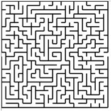

# DFS Maze Generator

## Zastosowanie algorytmów grafowych do generacji labiryntów

Szereg algorytmów grafowych (np. algorytm DFS, algorytm Prima oraz algorytm Kruskala) po pewnych modyfikacjach można użyć do generowania labiryntów (takich jak np. ten poniżej).

  

Jednym z najprostszych podejść jest wykorzystanie zmodyfikowanego algorytmu DFS.
Najprostsze podejście jest następujące:  wyobraźmy sobie labirynt jak siatkę komórek. Każda komórka ma 4 sąsiadów (nie licząc komórek leżących przy granicy labiryntu, które mają trzech sąsiadów).
1)	Początkowo wybieramy (zadajemy lub losujemy) jedną komórkę leżącą przy ścianie, oznaczamy ją jako odwiedzoną.
2)	Następnie losowo wybieramy któregokolwiek z jej nieodwiedzonych sąsiadów i likwidujemy ścianę między tymi komórkami. Wylosowaną komórkę oznaczamy jako odwiedzoną.
3)	Następnie (tak jak przy przeszukiwaniu grafu w głąb) powtarzamy krok drugi (startując z kolejnych odwiedzanych komórek) aż dotrzemy do komórki, która nie ma nieodwiedzonych sąsiadów.
4)	Gdy natkniemy się na taką komórkę cofamy się (po tej samej trasie, którą dotarliśmy do aktualnej komórki) aż natkniemy się na komórkę, która ma nieodwiedzonych sąsiadów. Wtedy postępujemy jak w punkcie 2.
5)	Gdy wrócimy do komórki startowej labirynt jest gotowy.

Jako zadanie proszę Państwa o implementację któregoś z algorytmów grafowych do generowania labiryntu (algorytmy Prima i Kruskala będziemy omawiać na ćwiczeniach). Zadanie można wykonywać w praktycznie dowolnym języku (preferuję C++, C#, Java, Python, ale po konsultacji ze mną dopuszczam także możliwość wykorzystania innych języków lub technologii).
W tym zadaniu liczy się także ogólny efekt, na który składa się m.in. interfejs użytkownika oraz możliwości konfiguracyjne programu (np. wybór rozmiaru labiryntu). Program można wykonać zarówno w wersji okienkowej jak i konsolowej (choć jest oczywiste, że wersja okienkowa oferuje lepsze możliwości wizualizacji).
Więcej informacji na temat generowania labiryntów za pomocą algorytmów grafowych można znaleźć np. tutaj:  https://pl.qaz.wiki/wiki/Maze_generation_algorithm
